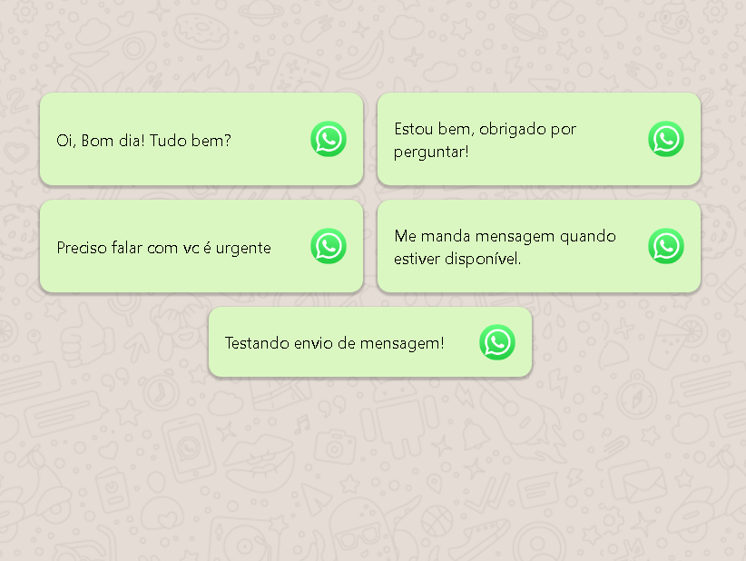

<h4 align="center"> 
	 ♻️ Concluído
</h4>

---

  <a href="#-sobre-o-projeto">Sobre</a> •
  <a href="#-funcionalidades">Funcionalidades</a> •
  <a href="#-layout">Layout</a> • 
  <a href="#-como-executar-o-projeto">Como executar</a> • 
  <a href="#-tecnologias">Tecnologias</a> •
  <a href="#-autor">Autor</a> • 
  <a href="#user-content--licença">Licença</a>

## 💻 Sobre o projeto

Projeto Auto Msg - é uma ferramenta de automação feita em JavaScript para envio de mensagens ja definidas através da plataforma do Whatsapp Web.

---

## ⚙️ Funcionalidades

- [x] Envio de mensagens padronizadas através do Whatsapp Web.

---

## 🎨 Layout - Web

  

---

## 🚀 Como executar o projeto

## 🛠 Tecnologias

As seguintes ferramentas foram usadas na construção do projeto:

#### **Website**  

-   **Html**
-   **CSS**
-   **JavaScript**
-   Editor:  **[Visual Studio Code](https://code.visualstudio.com/)**

---

## 💪 Como contribuir para o projeto

1. Faça um **fork** do projeto.
2. Crie uma nova branch com as suas alterações: `git checkout -b my-feature`
3. Salve as alterações e crie uma mensagem de commit contando o que você fez: `git commit -m "feature: My new 

---

## 🦸 Autora
Luciana Pessoa

## 📝 Licença

Este projeto esta sobe a licença [MIT](./LICENSE).

Feito com ❤️ por Luciana Pessoa 👋🏽 [Entre em contato!]

---
